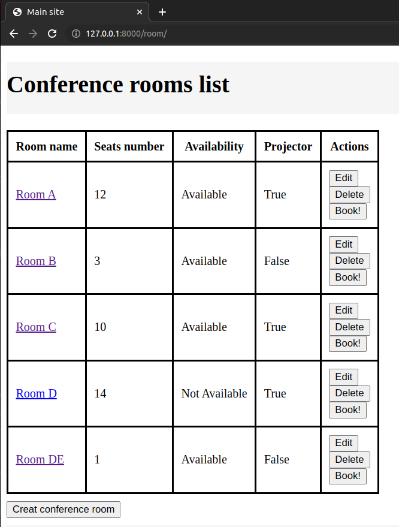
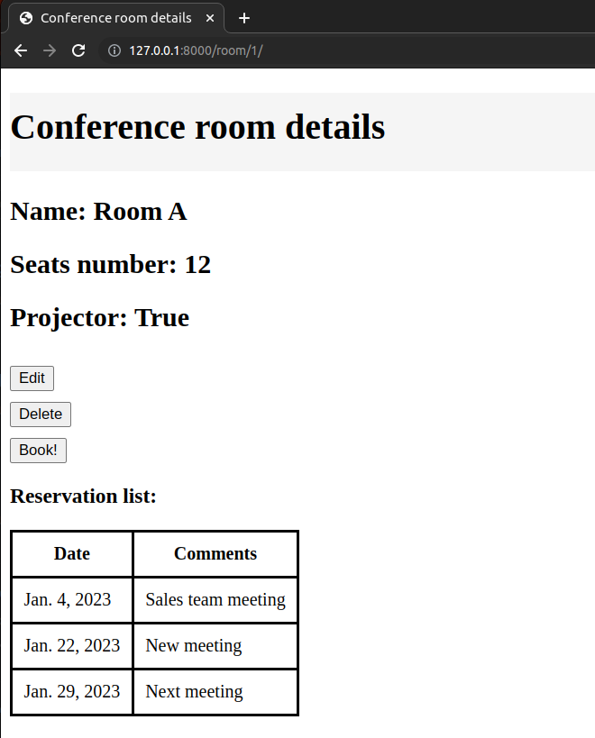

# Booking conference rooms web app.

### Descripton:
Application created for booking conference rooms.

Django framework

### Application functions:
1. main site - all conference rooms list - http://127.0.0.1:8000/room/

2. Detailed view of conference room - http://127.0.0.1:8000/room/{id}

4. Creating new confernce room.
4. Conference room reservation.
5. Conference room edition.
6. Conference room search - ongoing. Need time to finish view :)

