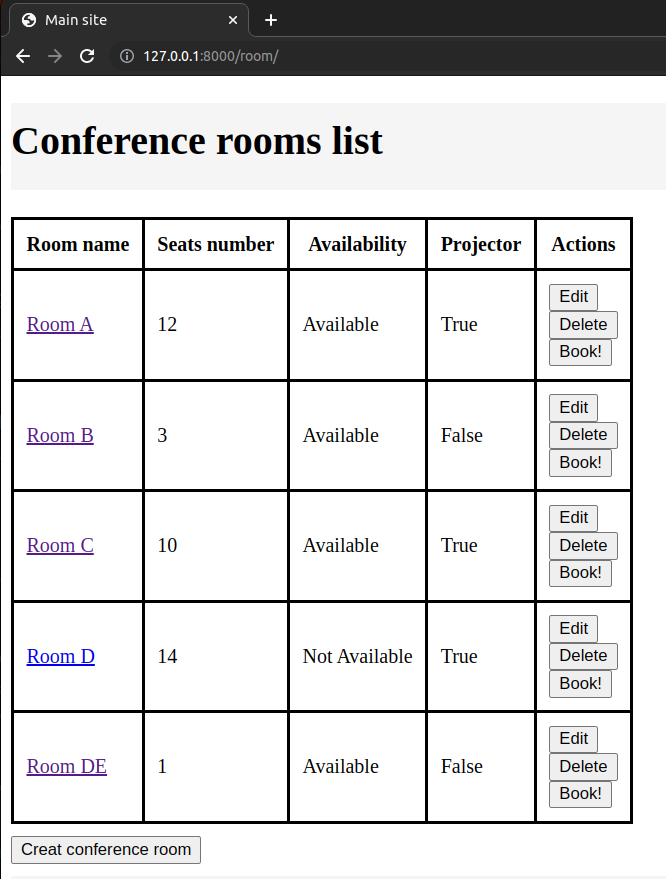
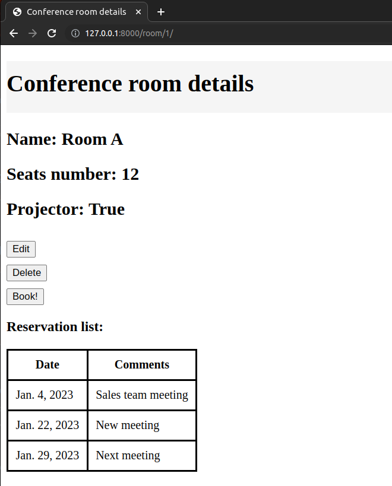
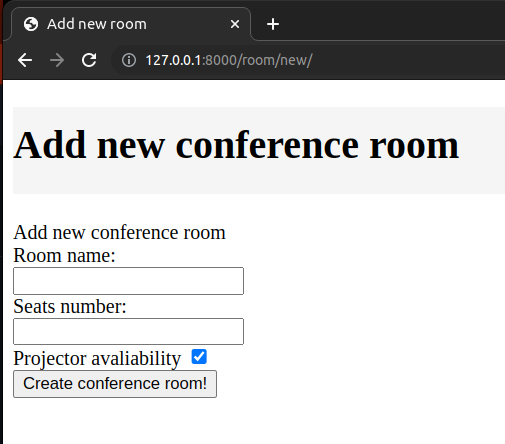
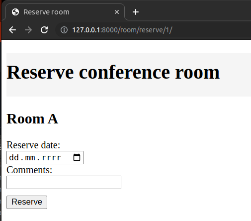
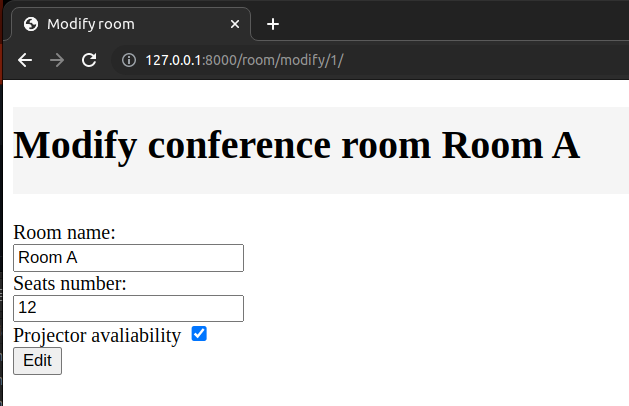

# Booking conference rooms web app.


## Descripton:
Application created for booking conference rooms.

## Requirements:
```
PostgresSQL

asgrief==3.4.2
Django==4.1.3
psycopg2-binary==2.9.5
sqlparse==0.4.3
setuptools==59.6.0
```
## Instalation & configuration:

### Step 1: Install PostgresSQL locally.
```
sudo apt-get install postgresql 
```

### Step 2: clone repository.
```
path/to/folder
git clone git@github.com:LaskiKa/Booking-conference-room-app.git
```
### Step 3: Create virtual enviroment & install requirements.txt
```
python -m venv venv
source venv/bin/activate
pip install -r requirements.txt
```

### Step 4: Setup database.
```
create database 'booking_conf_rooms_db'

set postgresql database in settings.py
DATABASES = {
    'default': {
        'HOST': '127.0.0.1',
        'NAME': 'booking_conf_rooms_db',
        'ENGINE': 'django.db.backends.postgresql',
        'USER': 'postgres',  
        'PASSWORD': 'postgres',
    }
}
```

### Step 5: run server.
```
python manage.py makemigrations
python manage.py migrate
python manage.py runserver localhost:8000
```

## Application functions:

1. main site - all conference rooms list - http://127.0.0.1:8000/room/
- View of all meeting rooms with **today's availability status**
- Room name is link for more details
- Link to the room details is provided by the room's name. 
- There are buttons for editing, booking and deleting room.
- Conference room list is order by id



2. Detailed view of conference room - http://127.0.0.1:8000/room/{id}
- View provides detailed information about the conference room.
  - name, 
  - seats number, 
  - projector, 
  - reservation list sorted from the oldest.
- There are buttons for editing, booking and deleting room.



4. Creating new confernce room - http://127.0.0.1:8000/room/new/

- View allows  to add a new room.
- The view verifies:
  - is room name input is not empty,
  - is room name  existing in database,
  - is seats number a positive number,
  - Save the new room to the database and redirect the user to the home page if the data is correct. 
  - If they are incorrect, the user will see an appropriate message. 



4. Conference room reservation - http://127.0.0.1:8000/room/reserve/{id}

- The view allows to book a room and leave a comment.
- The view verifies:
  - is date and room already reserved,
  - is not past date.



5. Conference room edition.

- The view allows to edit current room details.
- The view verifies:
  - is room name input is not empty,
  - is room name  existing in database,
  - is seats number a positive number,
  - Save the new room to the database and redirect the user to the home page if the data is correct. 
  - If they are incorrect, the user will see an appropriate message. 



6. Conference room search - ongoing. Need time to finish view :)


